## DNS Windows   Server ##

Comenzamos creando en *Windows 2012 Server* una **Zona de Búsqueda Directa e Inversa**, para servir las resoluciones de IP´s a nombres de dominio y viceversa, despues de instalar el servidor DNS en *Herramientas*:

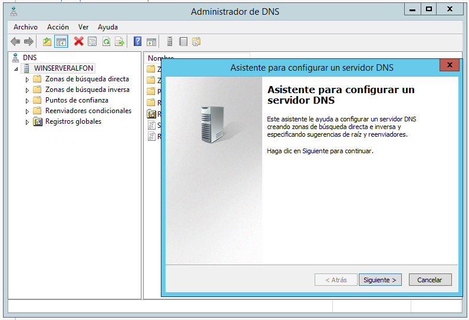

Aqui es donde indicamos que queremos crear ambas zonas de búsqueda:

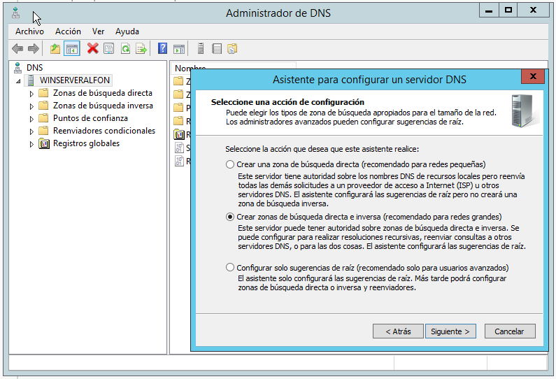

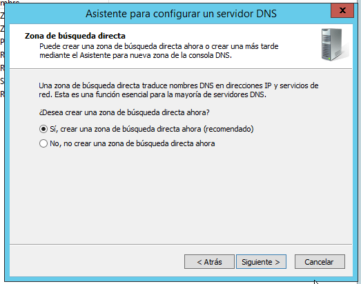

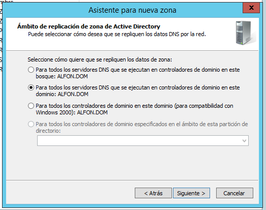

Le asignamos un nombre para tenerla identificada, en éste caso le ponemos la dirección de red que utilizamos:

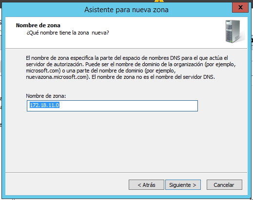

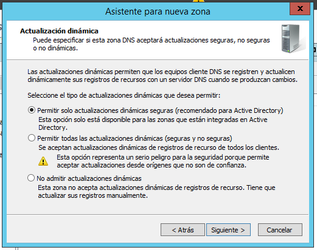

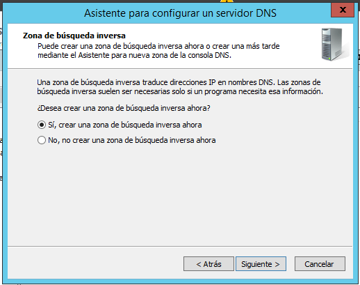

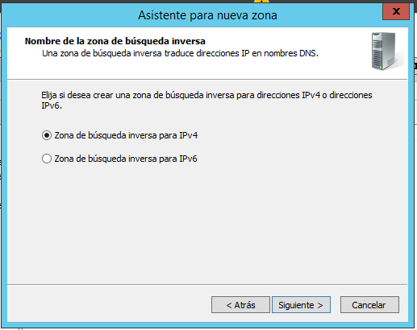

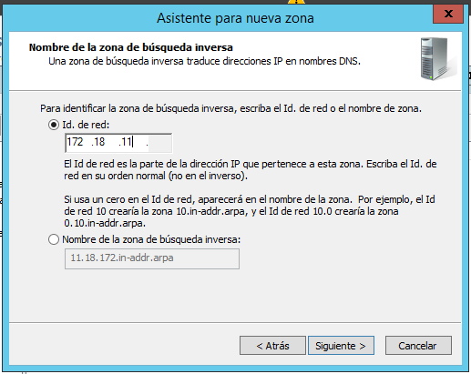

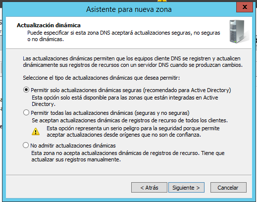

Aquí indicamos donde enviaría las consultas, y indicamos, por ejemplo, los DNS de *Google*

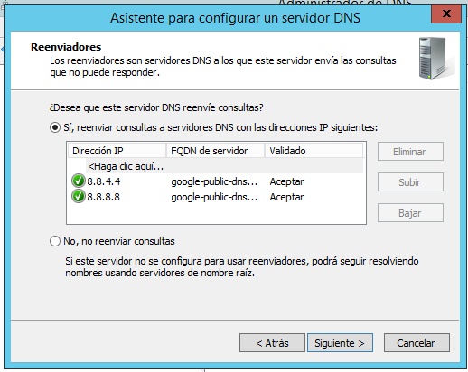

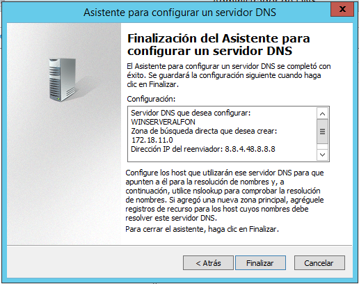

Aquí se puede comprobar la correcta conexión:

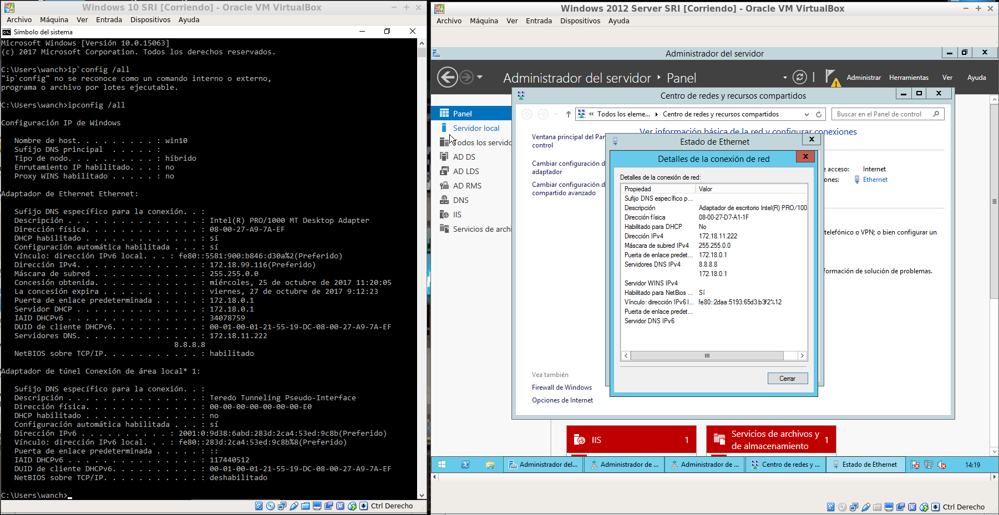

----

Vamos a crear en la zona de búsqueda directa un registro llamado **servicios** donde añadiremos varias entradas:

* Un alias para tu servidor denominado server.
* Una impresora con IP fija denominada printer (no hace falta alias).
* Un servidor de correo (ficticio) denominado correo, asociado a una dirección en tu servidor.
* Crear una subzona denominada servicios (dominio nuevo) y agregar a ésta un servidor ftp (asociado a la misma IP del servidor), una impresora nueva (con una IP fija) y el equipo del administrador del sistema (también con IP fija).

Se añaden de la misma manera, difiere los nombre y direcciones IP´s:

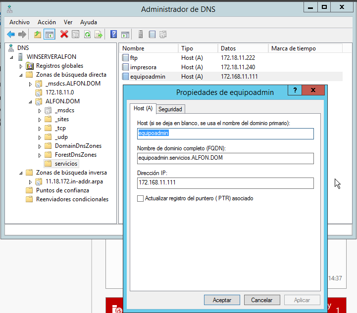

Una vez realizados todos los registros comprobamos:

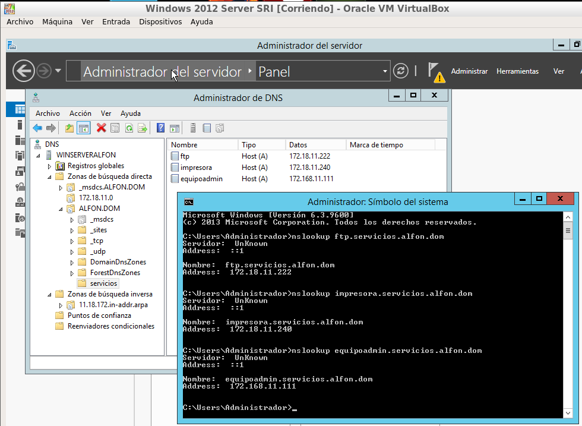
-----

Creamos los enlaces CNAME Y MX:

Seguimos con la validación de un cliente y la comprobación de éste haciendo uso del comando `nslookup`:

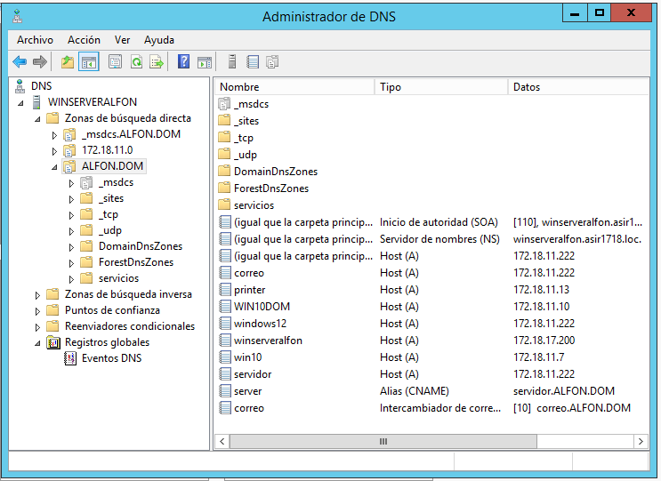

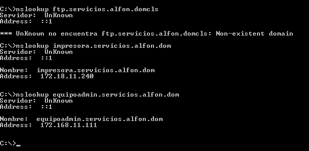
