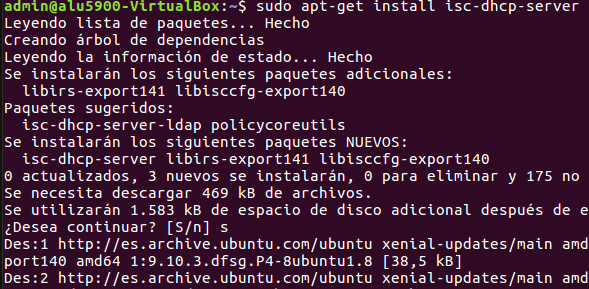
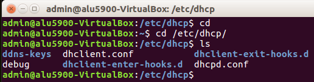
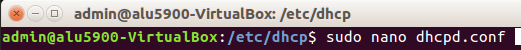
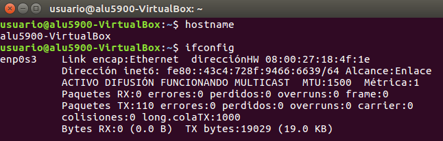
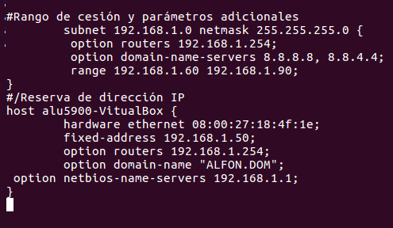
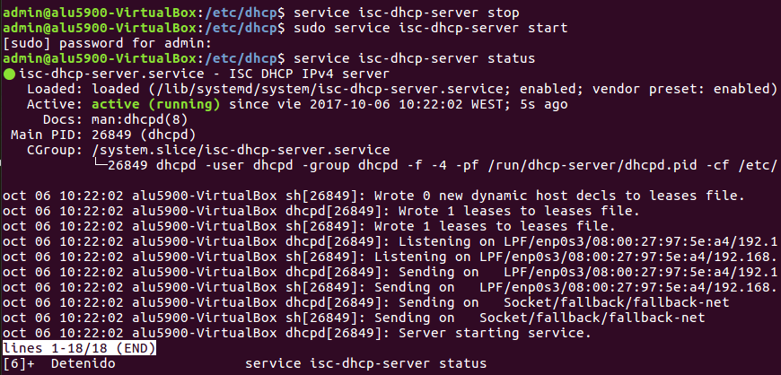
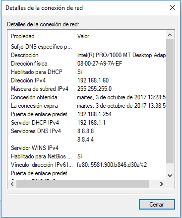

### Instalación_y_Configuración_DHCP_Linux ###
____

En un Host con Ubuntu, que usaremos como Server, descargamos el ***isc-dhcp-server*** que es el servidos DHCP para ubuntu:

Una vez instalado el servidor DHCP comenzamos a configurar el archivo ***dhcpd.conf***  en la ruta ***/etc/dhcp/***

Comprobamos los datos de red del cliente que añadiremos en la reserva de IP para que siempre se le asigne la misma.

Donde nos fijamos en la direcciónHW (la dirección MAC) que es la que tenemos que utilizar en la reserva de rango.

Rellenamos los datos de la red

En reserva de dirección añadimos los datos del pc que queramos pre-adjudicar una IP a un Host a traves de la dirección MAC.
Una vez configurado el archivo dhcpd.conf reiniciamos el servicio de la siguiente manera:

Pasamos a las comprobaciones
Arrancamos la máquina Ubuntu para comprobar si se le adjudica la IP señalada anteriormente (192.168.1.50):

Verificamos que, efectivamente, se le asignó la ip señalada.

Por otro lado, ejecutamos un Hosts con Windows10 y comprobamos si el Servidor DHCP le asigna, correctamente una IP del rango señalado:

Efectivamente, se le asignó la IP 192.168.1.60 la cual esta dentro del rango 192.168.1.60 - 192.168.1.90, dando por correcta la configuración del Server DHCP.
