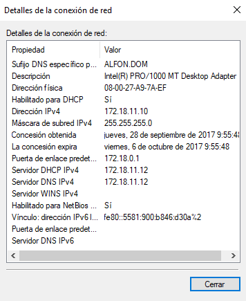
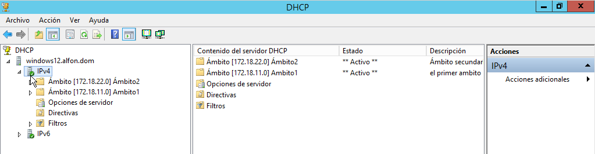

### Instalación y Configuración DHCP Windows

En una máquina con Windows Server 2012 instalamos el servicio DHCP:

Una vez instalado el servicio creamos un ámbito con el intervalo de direcciones IP deseado, en este caso:
172.18.11.10 hasta 172.18.11.20, con máscara /24. Por lo que los equipos que se conecte al servidor DHCP obtendrán una IP dentro de ese intervalo, menos una dirección, la cual veremos en el siguiente paso:

Es el momento de añadir la exclusión, en el presente caso excluimos la dirección 172.18.11.12 por se la misma que utiliza el servidor DHCP, con lo que evitaremos futuros conflictos de IP´s:

Proseguimos con la duración de concesión de las IP´s administradas por el servidor DHCP, en este caso de 8 días:

El siguiente paso es agregar una puerta de enlace, la cual es 172.18.0.1 y el dominio ALFON.DOM.

Se comprueba, la satisfactoria, creación del ámbito:

Comprobamos en una máquina cliente que asigna y adjudica las direcciones correctamente:

Como se puede comprobar, el servidor DHCP asignó al cliente la dirección 172.18.11.10 siendo ésta la primera IP asignable del rango anteriormente configurado, el cual era de .10 a la .20 con la exclusión de la .12 que es la que le corresponde al servidor.
Proseguimos con la creación de un segundo ámbito y le asignamos el intervalo, en este caso  172.18.22.100 hasta 172.18.22.200 de igual manera que con el ámbito 1, al segundo ámbito le marcamos una reserva de IP con la MAC de la tarjeta de red.

En éste caso se le asigna la IP correspondida con la dirección MAC indicada en la reserva:

Una vez creado los dos ámbito, procedemos a crear un superámbito que englobe los dos anteriores

Le ponemos nombre al superámbito. En éste caso “Superamb1”.

